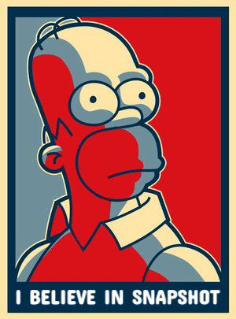

# SwiftSnapshotTesting

<p align="left">
    
</p>

This project's purpose is to simplify UI testing on iOS.

`SwiftSnapshotTesting` helps to check application's UI with a few lines of code. No need to manually manage reference images any more.

This framework is able to:
* take a screenshot of a full screen, screen without status bar or any `XCUIElement` individually
* record the screenshot on your Mac
* compare and highlight the difference between new screenshots and previously recorded ones using [`Metal`](https://developer.apple.com/metal/)

Internally `SwiftSnapshotTesting` operates with [`MTLTextures`](https://developer.apple.com/documentation/metal/mtltexture) during the snapshot comparison. Also it uses [`Resources Bridge Monitor`](ResourcesBridgeMonitor/) app to read and write files on Mac.

⚠️ Currently this project is in early alfa stage and it's a subject for improvements.

## Requirements

* Swift `5.2`
* iOS `11.0`

## Install via [`Cocoapods`](https://cocoapods.org)

```ruby
pod 'SwiftSnapshotTesting'
```

## How To Use

* Create a subclass of `SnapshotTestCase`

  ```Swift
  class MyCoolUITest: SnapshotTestCase { ...
  ```

* Choose folder on your Mac to store the reference snapshots by overriding `snapshotsReferencesFolder` variable

  ```Swift
  override var snapshotsReferencesFolder: String {
      "/Path-To-Snapshots-Folder/"
  }
  ```


* Assert UI element

  ```Swift
  assert(element: XCUIElement,
         testName: String,
         ignore rects: Set<CGRect>,
         configuration: Configuration,
         recording: Bool) throws
  ```

  * `element` - element to compare.
  * `testName` - name of the test. It will be used in the name of the reference image file
  * `rects` - rects (possible subviews' frames) to ignore.
  * `configuration` current test configuration.
  * `recording` - by setting `true` this argument you will record the reference snapshot. By setting `false` you will compare the element with previously recorded snapshot.


* Assert screenshot

  ```Swift
  assert(screenshot: XCUIScreenshot,
         testName: String,
         ignore ignorables: Set<Ignorable>,
         configuration: Configuration,
         recording: Bool) throws
  ```

  * `screenshot` - screenshot to test.
  * `ignorables` - UI elements to ignore. `Ignorable` can be `XCUIElement`, custom `CGRect` or predefined `.statusBar`.

# XCTAttachment

After each assertion test `SnapshotTestCase` provides an attachment containing per-pixel L2 distance between snapshot and the corresponding reference and `MTLTexture` with highlighted difference. You are able to look at the diff using [`MTLTextureViewer`](https://github.com/eugenebokhan/MTLTextureViewer/).

# Example

Your can find a small [example](https://github.com/eugenebokhan/ImageFlip/blob/master/ImageFlipUITests/ImageFlipUITests.swift) of usage of `SwiftSnapshotTesting` in the [`ImageFlip`](https://github.com/eugenebokhan/ImageFlip/) repo.

# [License](LICENSE)

MIT
